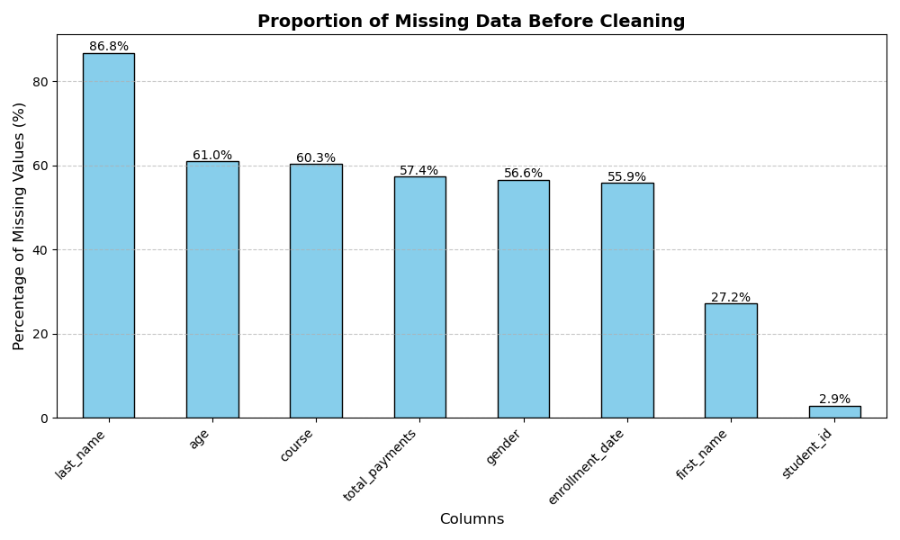
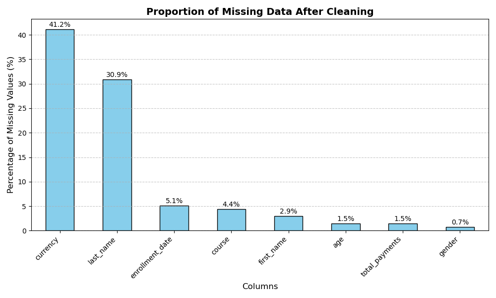

# 📚 Student Enrollment Records – Data Cleaning & Quality Assurance

## 1. Project Overview

**Title:** Data Cleaning and Quality Assurance for Student Enrollment Records  

**Company / Context:**  
Eduvos is a newly founded college specializing in tech-focused courses. Its student enrollment system relies on manual data entry, which has resulted in errors, inconsistencies, and unreliable data.  

**Problem Statement:**  
Manual entry caused major issues, including:  
- Multiple attributes merged into the `student_id` field.  
- Missing or misplaced IDs, names, ages, genders, courses, dates, and payment information.  
- Inconsistent formatting across key fields.  
- Embedded currency symbols in `total_payments`.  

**Objective:**  
- Clean, restructure, and validate the dataset.  
- Ensure consistent formatting and referential integrity.  
- Produce a reliable system of student records for reporting and analysis.  

## Link to SQL Scripts / Cleaning Code

The data cleaning process was carried out in **8 structured steps**, each addressing a specific data issue. Click the links to view the SQL code for each step.

1. **Step 0 – Load and Preview Data**  
   Initial parsing of the CSV file into a DuckDB table to inspect the dataset and understand its structure.  
   [View SQL Script](./sql_scripts/stp0.sql)

2. **Step 1 – Resolving Trapped `student_id` Data**  
   Many student records had multiple attributes concatenated in the `student_id` column using `|`. This step split the fields into `student_id`, `first_name`, `last_name`, `age`, `gender`, `course`, `enrollment_date`, and `total_payments`.  
   [View SQL Script](./sql_scripts/stp1.sql)

3. **Step 2 – Standardizing Age and Gender**  
   Cleaned `age` values (removed asterisks, corrected misalignments) and standardized `gender` to `M`/`F`. Also resolved cases where age and gender were combined in a single column.  
   [View SQL Script](./sql_scripts/stp2.sql)

4. **Step 3 – Handling Missing Student IDs**  
   Introduced temporary IDs (`TEMP-`) for students with missing `student_id` and created a column `id_status` to track which IDs were generated.  
   [View SQL Script](./sql_scripts/stp3.sql)

5. **Step 4 – Standardizing Course Names**  
   Cleaned inconsistencies in course names and matched them to reference courses, ensuring consistent naming conventions.  
   [View SQL Script](./sql_scripts/stp4.sql)

6. **Step 5 – Cleaning Total Payments and Extracting Currency**  
   Removed currency symbols embedded in `total_payments`, stored numeric values in the main column, and extracted the currency into a separate column.  
   [View SQL Script](./sql_scripts/stp5.sql)

7. **Step 6 – Standardizing Enrollment Dates**  
   Converted all date formats to `DD-MM-YYYY`, handling multiple inconsistent formats in the dataset.  
   [View SQL Script](./sql_scripts/stp6.sql)

8. **Step 7 – Reporting Convenience**  
   Created a `display_name` field by concatenating `first_name` + `last_name` to simplify reporting and analysis.  
   [View SQL Script](./sql_scripts/stp7.sql)

---

## 2. Data Structure Overview

**Dataset Snapshot:**  

*Snapshot of the dataset after initial load (used instead of ERD):*  

**Key Columns Overview:**

| Column Name        | Purpose / Notes                                     |
|-------------------|---------------------------------------------------|
| student_id         | Unique identifier for each student, standardized and validated |
| first_name         | Student first name                                 |
| last_name          | Student last name                                  |
| age                | Numeric age, standardized                          |
| gender             | Uppercase `M` / `F`                                |
| course             | Course name cleaned and standardized              |
| enrollment_date    | Standardized to DD-MM-YYYY                         |
| total_payments     | Numeric value only; currency captured separately  |
| currency           | Extracted from total_payments                      |

---

## 3. Executive Summary

High-level findings:  
- Only ~30% of student records were accurate initially.  
- Trapped `student_id` values accounted for 60% of data issues.  
- Temporary IDs were introduced for 20% of students missing `student_id`.  
- Inconsistent course names, dates, gender, age, and financial fields impacted reporting and analysis.  

---

## 4. Insights Deep Dive

- **Step 0 – Initial Data Load and Preview**  
  - **Issue / Observation:** Need to inspect CSV structure before cleaning.  
  - **Action Taken:** Parsed the CSV into a DuckDB table to prepare for transformations.  
  - **SQL Script:** [stp0.sql](sql_scripts/stp0.sql)  

- **Step 1 – Trapped `student_id` Concatenated with `|`**  
  - **Issue / Observation:** Multiple fields combined in `student_id` (`student_id|first_name|last_name|age|gender|course|enrollment_date|total_payments`).  
  - **Action Taken:** Split `student_id` into separate columns for proper structure.  
  - **SQL Script:** [stp1.sql](sql_scripts/stp1.sql)  

- **Step 2 – Gender and Age Inconsistencies**  
  - **Issue / Observation:** Gender values lowercase or missing; age has asterisks or is combined with gender.  
  - **Action Taken:** Standardized `gender` to `M/F`, cleaned `age` values, and resolved combined age/gender fields.  
  - **SQL Script:** [stp2.sql](sql_scripts/stp2.sql)  

- **Step 3 – Missing Student IDs**  
  - **Issue / Observation:** Some students missing `student_id`.  
  - **Action Taken:** Introduced temporary IDs (`TEMP_`) and created `id_status` column.  
  - **SQL Script:** [stp3.sql](sql_scripts/stp3.sql)  

- **Step 4 – Inconsistent Course Names**  
  - **Issue / Observation:** Course names inconsistent or misspelled.  
  - **Action Taken:** Standardized course names and mapped them to a reference table for consistency.  
  - **SQL Script:** [stp4.sql](sql_scripts/stp4.sql)  

- **Step 5 – Embedded Currency in Total Payments**  
  - **Issue / Observation:** `total_payments` contains currency symbols and inconsistent formatting.  
  - **Action Taken:** Removed symbols, stored numeric values in `total_payments`, and extracted currency into a separate column.  
  - **SQL Script:** [stp5.sql](sql_scripts/stp5.sql)  

- **Step 6 – Enrollment Dates in Multiple Formats**  
  - **Issue / Observation:** Dates stored in different formats (`DD-MMM-YY`, `YYYY-MM-DD`, etc.).  
  - **Action Taken:** Converted all dates to `DD-MM-YYYY` format for standardization.  
  - **SQL Script:** [stp6.sql](sql_scripts/stp6.sql)  

- **Step 7 – Reporting Convenience**  
  - **Issue / Observation:** Reporting requires full names for easier readability.  
  - **Action Taken:** Created `display_name` by concatenating `first_name` + `last_name`.  
  - **SQL Script:** [stp7.sql](sql_scripts/stp7.sql)  

**Before / After Data Quality Comparison:**  

- *Bar graph comparing missing data and quality issues before vs after cleaning*  

  
  

---

## 5. Recommendations

- **Reference Tables:** Use `course_id` instead of `course_name` to enforce referential integrity.  
- **Standardize Formats:** Dates (DD-MM-YYYY), numeric currency values, uppercase gender.  
- **Validation at Entry:** Implement checks to prevent trapped data or missing IDs.  
- **Automated Temporary IDs:** Ensure every student has a unique identifier.  
- **Tracers / Audits:** Monitor missing or inconsistent records regularly.  

*Business Impact:* Improved reporting accuracy, reduced manual cleanup effort, and reliable analytics for stakeholders.

---

## 6. Analytical Workflow

1. **Load CSV and Inspect Data** – initial overview using pandas and skimpy report.  
   - Original CSV: [Unclean Dataset](C:\Users\Prime\Music\Projects 25\Student-Records\Unclean_Dataset_1.csv)  
2. **Parse into SQL Table** – for efficient transformations.  
3. **Stepwise Cleaning:**  
   - Split trapped data  
   - Standardize age and gender  
   - Handle missing IDs  
   - Standardize courses  
   - Clean total payments and separate currency  
   - Standardize enrollment dates  
   - Create display_name field  
4. **Final Data Quality Assessment** – validate key fields and check remaining nulls.  
   - Cleaned CSV: [Cleaned Student Records](C:\Users\Prime\Music\Projects 25\Student-Records\Cleaned_Student_Records.csv)  

---

## 7. Visuals & Deliverables

- **Dataset Snapshot:** 
- **Before / After Data Quality Comparison:**  
  - Before Cleaning:   
  - After Cleaning:   

---

## 8. Lessons Learned

- Real-world datasets require **structured cleaning** before analysis.  
- Manual entry creates compounded issues; SQL provides **repeatable, auditable cleaning processes**.  
- Proper documentation + standardized fields improve long-term data quality.  
- Linking to scripts demonstrates **technical transparency** for recruiters.

---

## 9. Interactive Artifacts

- Jupyter Notebook: [records-cleaning.ipynb](./records-cleaning.ipynb)  
- SQL Scripts: [All SQL Scripts](./sql_scripts/)  
- Raw Data: [Unclean Dataset](./Unclean_Dataset_1.csv)  
- Cleaned Data: [Cleaned Dataset](./Cleaned_Student_Records.csv)

